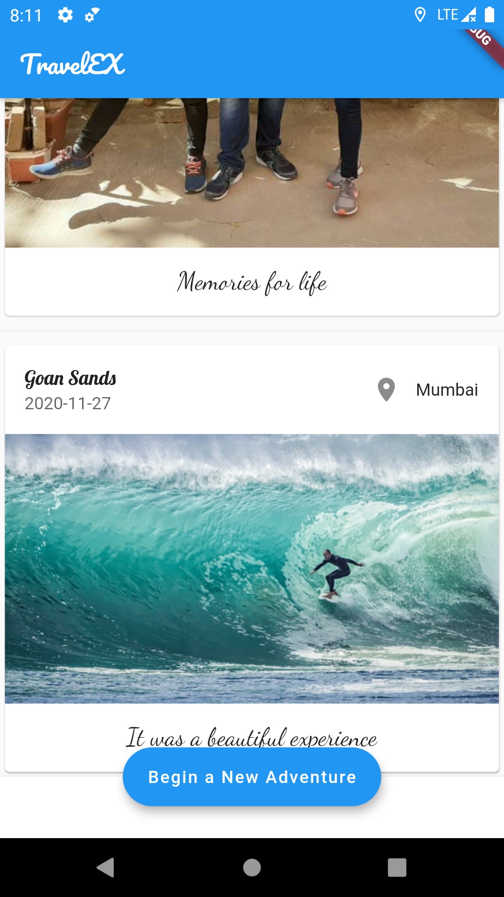
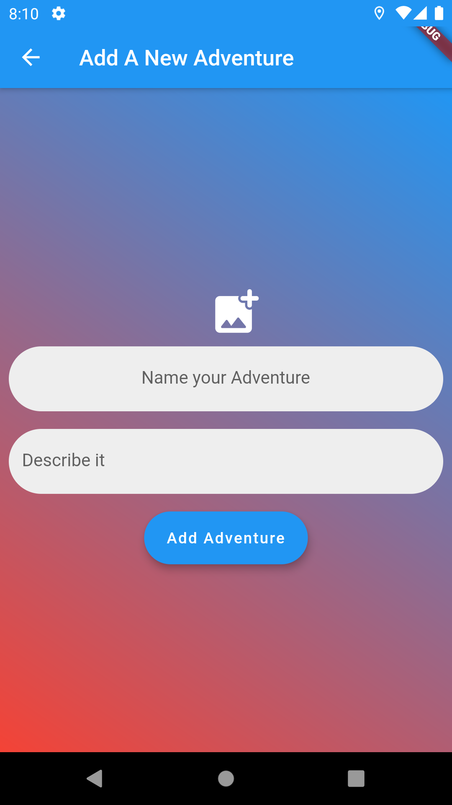
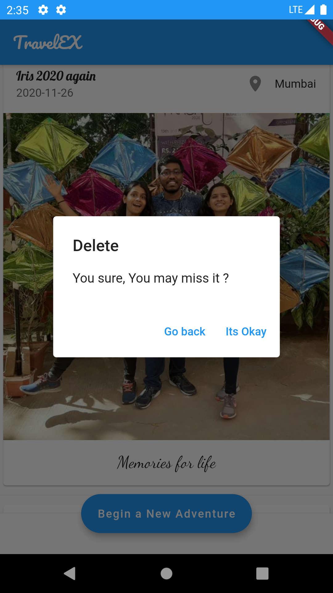

# TravelEX
## A Diary for the Travellers
### About the Project
A cross platform application that allows users to capture memories on their travel adventures, add images as well as location. It also allows travellers to keep a track of their ‘Memories’.

Overall ‘ TravelEX’ is your travelogue diary to store memories and pictures.

**FEATURES**

 - Cross Platform Support (Works on both Android and iOS)
 - Light-weight and Interattive UI
 - Add an Image for each Memory, from the Gallery
 - Local Database
 - In-Built Database encryption
 - Real Time Location capture
 - Automatic System date and time capture
 - Permission Request, for Location and Storage Services
 - Push Notifications

**Developers**

 - [Agnellus Fernandes ](https://www.linkedin.com/in/agnellus-fernandes-81232b192)
 
 - [Sancia D'cunha](https://www.linkedin.com/in/sancia-d-cunha-291a94194)

  - [Anisha Fernandes](https://www.linkedin.com/in/anisha-fernandes-9063651a1)
## Screenshots

1.Login Page

***

2.Dashboard

***

3.Add Memory Screen

***

4.Delete Memory

***
**Tools used**  

 - Android Studio (Obviously)
 - [Dart Programming Language](https://dart.dev/)
 - [Hive database](https://pub.dev/packages/hive)
 - [image_picker](https://pub.dev/packages/image_picker)
 - [flutter_local_notifications](https://pub.dev/packages/flutter_local_notifications)
 - [geolocator](https://pub.dev/packages/geolocator)
 - [geocoder](https://pub.dev/packages/geocoder)
 - [path_provider](https://pub.dev/packages/path_provider)
 - [image](https://pub.dev/packages/image)
 - [fluttertoast](https://pub.dev/packages/fluttertoast)
 - [google_fonts](https://pub.dev/packages/google_fonts)
